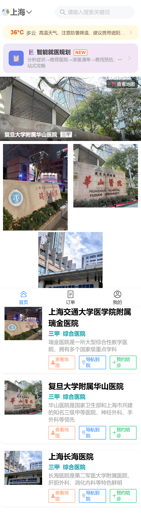
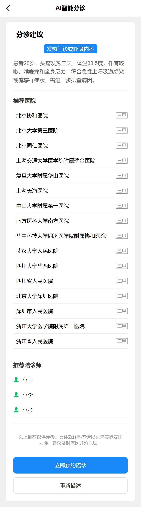
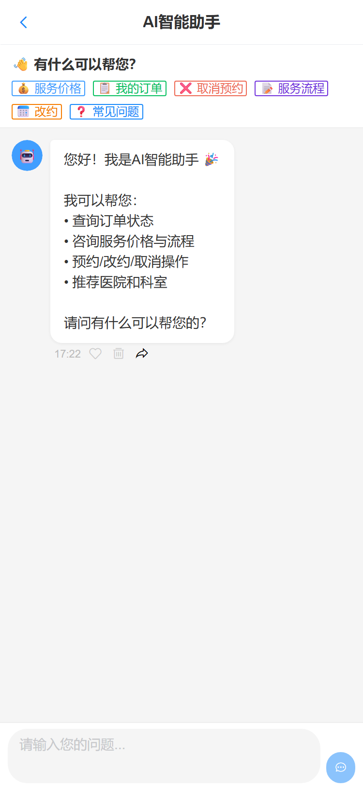
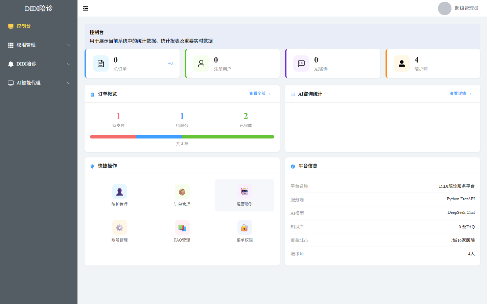
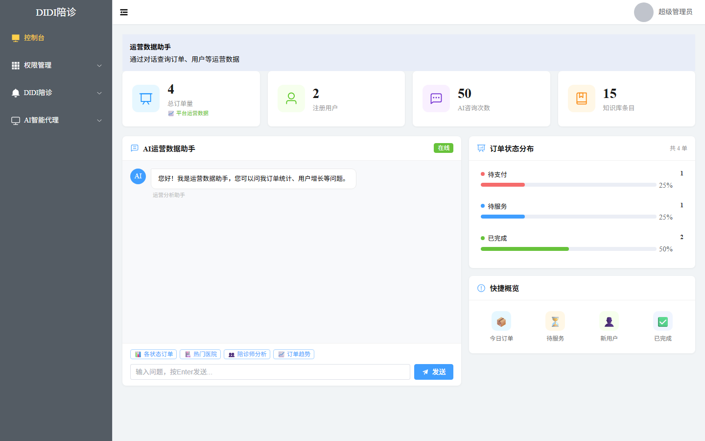
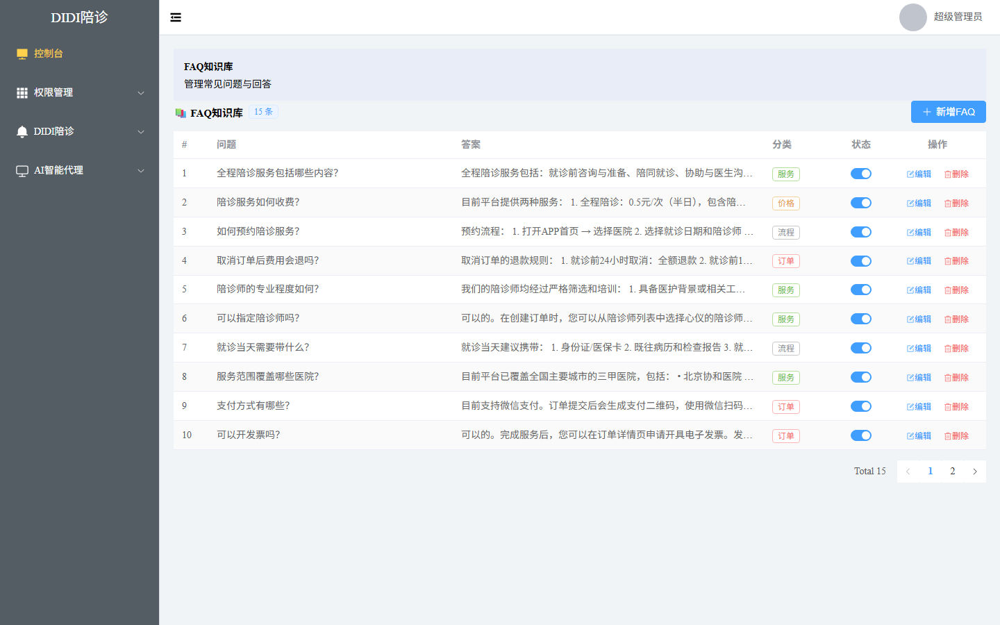
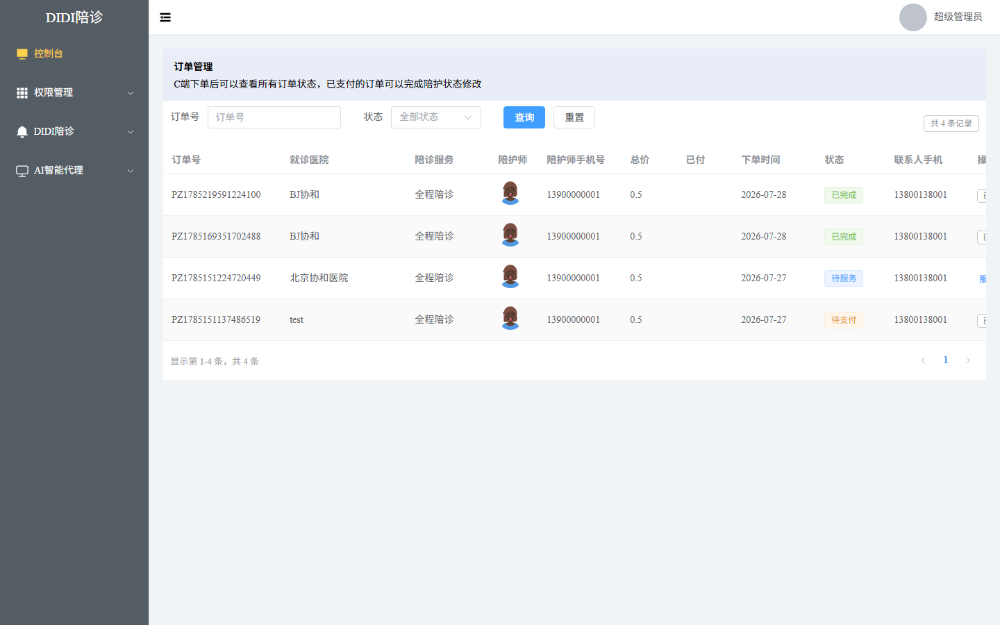

# 🏥 DIDI陪诊服务平台

> 基于 AI Agent 的智慧医疗陪诊服务平台，包含 C端用户端（H5）和后台管理系统。

## 📸 功能截图

### 📱 H5 移动端（用户端）

| 🏠 首页（城市定位+天气+AI分诊+医院列表） | 🤖 智能分诊（填写症状） | 📋 分诊推荐结果（科室+医院+陪诊师） | 💬 AI客服对话（自动问答） |
|------|-------------------|-------------------|-----------|
|  |  |  |  |

### 🖥 后台管理（管理员端）

| 📊 控制台（业务总览） | 🤖 运营数据助手（AI对话查数据） | 📚 FAQ知识库（问题管理） | 📦 订单管理（状态筛选） |
|--------|------------|----------|---------|
|  |  |  |  |

---

## 📱 项目概览

一个完整的陪诊服务数字化平台，用户可以通过 H5 端预约陪诊服务、智能分诊、AI客服咨询，管理员通过后台管理系统进行订单、陪护师、权限等全流程管理。系统集成了 **DeepSeek 大模型** 驱动的多 AI Agent 智能体系。

### 核心能力

| 端 | 面向 | 核心功能 |
|----|------|---------|
| **pzH5** | 就诊用户 | 智能就医规划（多Agent协作）、智能分诊、AI客服、预约下单、订单管理、医院导航 |
| **pzadmin** | 管理员 | 订单管理、陪护师管理、菜单权限、AI运营分析、FAQ知识库 |
| **pz-backend** | API服务 | AI Agent 编排、业务API、数据持久化 |

---

## 🧠 AI Agent 系统

系统集成了 **8 个专业 AI Agent**，由 LangChain + DeepSeek API 驱动，采用 **"单一职责 Agent + 智能编排"** 架构：

| Agent | 职责 | 使用场景 |
|-------|------|---------|
| 🤖 **分诊推荐Agent** | 症状分析 → 推荐科室、医院、陪诊师 | 智能分诊、就医规划第一步 |
| 🏥 **医院推荐Agent** | 基于科室/城市推荐医院及理由 | 就医规划模块 |
| 📝 **就诊准备Agent** | 生成就医前准备清单（证件/饮食/着装） | 就医规划模块 |
| 💰 **费用预估Agent** | 分项预估挂号/检查/药费 + 医保参考 | 就医规划模块 |
| 🧠 **综合合成Agent** | 汇总多Agent输出，整合成完整攻略 | 就医规划最后一步 |
| 💬 **智能客服Agent** | FAQ匹配 + LLM增强回答 | 解答价格、流程、订单等常见问题 |
| 📋 **订单助手Agent** | 订单查询、改约、取消 | 用户询问订单状态或需要操作订单 |
| 📊 **运营数据助手** | 数据统计、运营分析 | 管理员对话查询业务数据 |

### 两种智能模式

#### 1️⃣ 多 Agent 协作 —— 智能就医规划（真实编排）

项目的核心亮点：**Hierarchical 多 Agent 编排**。一次提问，5 个 Agent 分三阶段协作，产出完整就诊攻略。

```
用户输入症状
    │
    ▼  Phase 1 · 顺序执行（有数据依赖）
分诊Agent ──→ 产出：推荐科室 + 紧急程度
    │
    ▼  Phase 2 · 并行扇出（asyncio.gather 同时执行）
┌──────────────┬──────────────┬──────────────┐
│  医院推荐Agent │  就诊准备Agent │  费用预估Agent │
│ （基于科室+城市）│（基于科室+年龄）│（基于科室+等级）│
└──────────────┴──────────────┴──────────────┘
    └──────┬──────────┬──────────┬──────┘
           ▼          ▼          ▼
    ┌─────────────────────────────────┐
    │   综合合成Agent（一次LLM调用整合）   │
    │   → 生成「就医攻略」完整报告        │
    └─────────────────────────────────┘
```

**协作的三个关键点（可深挖）：**
1. **数据依赖**：Phase 1 分诊结果（科室、紧急程度）作为上下文，喂给 Phase 2 的 3 个 Agent
2. **并行执行**：3 个 Agent + 天气工具用 `asyncio.gather` 并发运行，互不等待
3. **结果汇聚**：合成 Agent 拿到 4 份独立输出，一次 LLM 调用整合成一份完整攻略

#### 2️⃣ 单 Agent 智能路由 —— 日常对话

客服 / 订单 / 分诊聊天采用**关键词意图路由**，本地匹配不调 LLM，低延迟、省 token：

```
用户提问 → 关键词路由（本地匹配）
    │
    ├─ "症状/咳嗽/发烧/头痛..." → 分诊Agent
    ├─ "订单/取消/改约/单号..." → 订单助手Agent
    ├─ "统计/分析/趋势/多少..." → 运营数据助手
    └─ 其他 → 智能客服Agent（FAQ匹配优先）
```

---

## 🔌 MCP（Model Context Protocol）接入

平台内置 **MCP Server**，把 Agent 依赖的数据库查询与外部 API 全部**标准化为 11 个 MCP 工具**，Agent 统一经工具层取数，同时端点对外暴露，可供 Claude Desktop / Cursor / MCP Inspector 等任何 MCP 客户端连接。

### MCP 端点

```
http://localhost:2306/v3pz/mcp/
```

> ⚠️ 尾斜杠必须带上；无尾斜杠会自动 307 跳转。

### 提供的工具（全部只读）

| 工具 | 说明 | 使用方 |
|---|---|---|
| `search_hospitals` | 按城市/名称搜索医院 | 分诊/医院推荐/客服/就医规划 |
| `list_companions` | 查询陪诊师列表 | 分诊 |
| `list_services` | 查询服务项目及价格 | 费用预估/客服 |
| `get_user_orders` | 查询用户订单 | 订单助手/客服 |
| `search_faq` | 搜索 FAQ 知识库（相关度打分） | 客服 |
| `get_business_stats` | 运营业务统计（订单/用户/陪诊师/收入） | 运营助手/Admin仪表盘 |
| `get_weather` | 获取城市当前天气 | 分诊/就医规划 |
| `get_travel_advice` | 根据天气生成出行建议 | 分诊/就医规划 |
| `calc_distance` | 两经纬度点间直线距离 | 就医规划 |
| `get_static_map_url` | 生成高德静态地图 URL | 对外暴露 |
| `get_hospital_image` | 获取医院实景图 URL | 对外暴露 |

### 如何连接

**MCP Inspector**：

```bash
npx @modelcontextprotocol/inspector
# 传输类型选 Streamable HTTP，URL 填 http://localhost:2306/v3pz/mcp/
```

**Claude Desktop**（`claude_desktop_config.json`）：

```json
{
  "mcpServers": {
    "pz-medical": {
      "url": "http://localhost:2306/v3pz/mcp/"
    }
  }
}
```

### 架构说明

- `app/mcp/tools.py` 是**工具唯一来源**（`TOOL_REGISTRY`），`server.py`（对外 MCP 端点）与 `client.py`（进程内门面）都遍历它注册，两边不会漂移
- Agent 进程内走 `client.py` 直接调用工具函数，不经过 MCP 协议开销；`tools.py` 复用了原 `utils/` 的天气/地图/距离封装，未重复实现
- `main.py` 通过 FastAPI lifespan 驱动 MCP session manager，保证挂载子应用正常运行

---

## 🏗️ 技术栈

| 层 | 技术 |
|---|------|
| **后端框架** | Python FastAPI |
| **AI框架** | LangChain + DeepSeek API |
| **Agent工具层** | MCP Server（官方 `mcp` SDK，Streamable HTTP） |
| **数据库** | MySQL + SQLAlchemy ORM |
| **认证** | JWT (python-jose) + bcrypt |
| **前端(H5)** | Vue3 + Vant4（移动端） |
| **前端(Admin)** | Vue3 + ElementPlus |
| **地图服务** | 高德地图 API（POI搜索 + 导航） |
| **天气服务** | wttr.in |

---

## 📂 项目结构

```
e:/vscode代码/项目/
├── pz-backend/                  # 后端服务
│   ├── app/
│   │   ├── agents/              # AI Agent 核心
│   │   │   ├── base.py          # BaseAgent 抽象类
│   │   │   ├── customer_service.py  # 客服Agent
│   │   │   ├── triage_agent.py      # 分诊Agent
│   │   │   ├── order_assistant.py   # 订单助手
│   │   │   ├── operations_agent.py  # 运营分析
│   │   │   ├── orchestrator.py      # Agent编排器
│   │   │   └── deepseek_llm.py      # DeepSeek 封装
│   │   ├── mcp/                 # MCP 模块
│   │   │   ├── tools.py         # 工具唯一来源（11个工具 + TOOL_REGISTRY）
│   │   │   ├── server.py        # MCP Server（挂载 /v3pz/mcp/）
│   │   │   └── client.py        # Agent 进程内调用门面
│   │   ├── routers/
│   │   │   ├── h5.py            # H5端 API
│   │   │   ├── admin.py         # 后台管理 API
│   │   │   └── agents.py        # Agent API
│   │   ├── models.py            # ORM 模型
│   │   ├── schemas.py           # Pydantic 校验
│   │   ├── config.py            # 配置
│   │   └── utils/               # 工具（天气、地图、距离）
│   ├── seed.py                  # 种子数据
│   ├── seed_agents.py           # Agent种子数据
│   ├── seed_faq.py              # FAQ种子数据
│   └── requirements.txt
├── pzH5/                        # H5移动端
│   └── src/
│       ├── pages/               # 页面
│       │   ├── home/            # 首页（医院列表、轮播）
│       │   ├── login/           # 登录
│       │   ├── order/           # 订单列表
│       │   ├── detail/          # 订单详情
│       │   ├── createOrder/     # 创建订单
│       │   ├── user/            # 个人中心
│       │   └── agent/           # AI功能
│       │       ├── triage/      # 智能分诊
│       │       └── chat/        # AI客服聊天
│       ├── api/index.js         # API 封装
│       └── router/index.js      # 路由配置
└── pzadmin/                     # 后台管理
    └── src/
        ├── views/
        │   ├── dashboard/       # 控制台
        │   ├── vppz/            # 陪诊业务
        │   │   ├── order/       # 订单管理
        │   │   └── staff/       # 陪护师管理
        │   ├── auth/            # 权限管理
        │   └── agent/           # AI运营
        │       ├── overview/    # 运营数据助手
        │       └── config/      # FAQ知识库
        ├── api/index.js         # API 封装
        └── router/index.js      # 路由配置
```

---

## 🚀 快速启动

### 1. 后端

```bash
cd pz-backend

# 安装依赖
pip install -r requirements.txt -i https://pypi.tuna.tsinghua.edu.cn/simple

# 初始化数据库（首次运行）
python app/seed.py
python app/seed_agents.py
python app/seed_faq.py
python app/seed_amap_images.py

# 启动服务
python run.py
# 服务运行在 http://localhost:2306
```

### 2. H5 移动端

```bash
cd pzH5
npm install
npm run dev
# 运行在 http://localhost:5500
```

### 3. 后台管理

```bash
cd pzadmin
npm install
npm run dev
# 运行在 http://localhost:5173
```

---

## 🔑 默认账号

| 端 | 账号 | 密码 |
|----|------|------|
| H5端 | `zhangsan` | `123456` |
| H5端 | `lisi` | `123456` |
| 后台管理 | `13800000000` | `admin123` |
| 后台管理 | `13800000001` | `123456` |

---

## ⚙️ 环境变量配置

项目使用 `.env` 文件管理敏感配置，**不要提交到 Git**：

```ini
# pz-backend/.env
DEEPSEEK_API_KEY=sk-your-key-here
DEEPSEEK_BASE_URL=https://api.deepseek.com
AMAP_KEY=your-amap-key-here
```

---

## 🌐 API 概览

### H5 端

| 方法 | 路径 | 说明 |
|------|------|------|
| POST | `/v3pz/login` | 用户登录（H5/Admin） |
| GET | `/v3pz/index/index` | 首页数据（医院列表、轮播） |
| GET | `/v3pz/h5/companion` | 创建订单页数据 |
| POST | `/v3pz/createOrder` | 创建订单 |
| GET | `/v3pz/order/list` | 订单列表 |
| GET | `/v3pz/order/detail` | 订单详情 |
| GET | `/v3pz/weather` | 天气出行建议 |
| POST | `/v3pz/agent/chat` | AI聊天（关键词路由分发） |
| POST | `/v3pz/agent/triage/recommend` | AI分诊推荐 |
| POST | `/v3pz/agent/visit-plan` | 智能就医规划（多Agent协作） |

### Admin 端

| 方法 | 路径 | 说明 |
|------|------|------|
| GET | `/v3pz/agent/admin/overview` | 运营数据总览 |
| GET | `/v3pz/agent/admin/business/stats` | 业务统计 |
| GET/POST | `/v3pz/agent/admin/faq/*` | FAQ CRUD |
| GET | `/v3pz/menu/permissions` | 动态菜单权限 |
| GET | `/v3pz/companion/list` | 陪护师列表 |
| GET | `/v3pz/admin/order` | 订单管理 |

---

## ✨ 核心功能截图

### H5 端功能

| 功能 | 说明 |
|------|------|
| 🏠 **首页** | 城市选择、天气出行提示、AI智能分诊、医院列表（含距离/导航/预约） |
| 🧭 **智能就医规划** | 多Agent协作生成完整就诊攻略（分诊→医院/准备/费用→合成） |
| 🤖 **AI智能分诊** | 输入症状→推荐科室/医院/陪诊师 |
| 💬 **AI客服** | 订单页悬浮球唤起，自动分发到对应Agent |
| 📋 **订单管理** | 按状态筛选、倒计时、模拟支付、一键导航 |

### 后台管理功能

| 功能 | 说明 |
|------|------|
| 📊 **控制台** | 订单概览、AI咨询统计、快捷操作、平台信息 |
| 🤖 **运营数据助手** | 自然语言对话查询运营数据 |
| 📚 **FAQ知识库** | 增删改查常见问题，AI客服优先匹配 |
| 👥 **陪护师管理** | CRUD + 图片选择器 |
| 📦 **订单管理** | 状态筛选、服务完成确认 |

---

## 📄 许可证

MIT

---

## 👨‍💻 开发者

[Zcj233-cyber](https://github.com/Zcj233-cyber)
